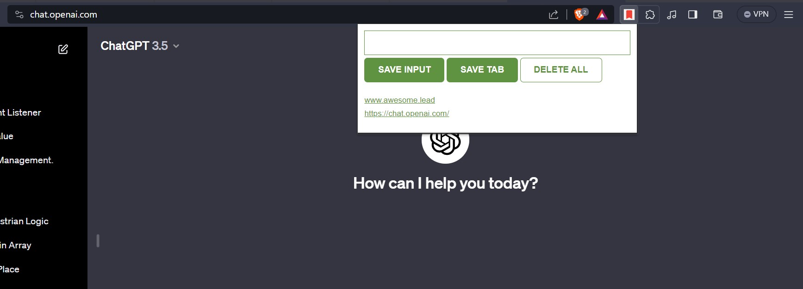

# My Chrome Extension - URL Saver

## Description
The "URL Saver" Chrome extension allows users to easily save URLs, including the current tab, and store them in the browser's localStorage. It provides a text input field to paste URLs and a dedicated button to save the current tab's URL. Additionally, there's a delete button to manage stored URLs.

## Features
- Save URLs, including the current tab's URL.
- Text input field to paste URLs for saving.
- Delete functionality to manage stored URLs.

## Installation
To use this extension:
1. Download the extension file from [url_tracker_extension.zip](https://github.com/jeevjacobgeorge/url_tracker_extension/files/13761571/url_tracker_extension.zip)
2. Open Google Chrome.
3. Go to `chrome://extensions/`.
4. Enable Developer mode.
5. Drag and drop the downloaded extension file (.crx or .zip) onto the Extensions page to install it.

## Usage
- After installing the extension, click on its icon in the Chrome toolbar to open the interface.
- Use the text input field to paste URLs you want to save.
- Click the "Save" button to store the entered URL.
- Click the "Save Current Tab" button to save the URL of the current tab.
- Use the "Delete" button to manage stored URLs.

## Support
For any issues, suggestions, or queries, please [create an issue](#link-to-issues) or contact me directly.

## Contributing
Contributions are welcome! If you want to contribute to this project, please fork the repository and submit a pull request.

## License
This project is licensed under the [MIT License](LICENSE).

## Credits
- Built with JavaScript, HTML, and CSS.

---

Feel free to tailor this template according to the specifics of your extension. Make sure to replace placeholders like `[link-to-releases]`, `[link-to-issues]`, and others with the actual URLs once you have your project uploaded to GitHub.
